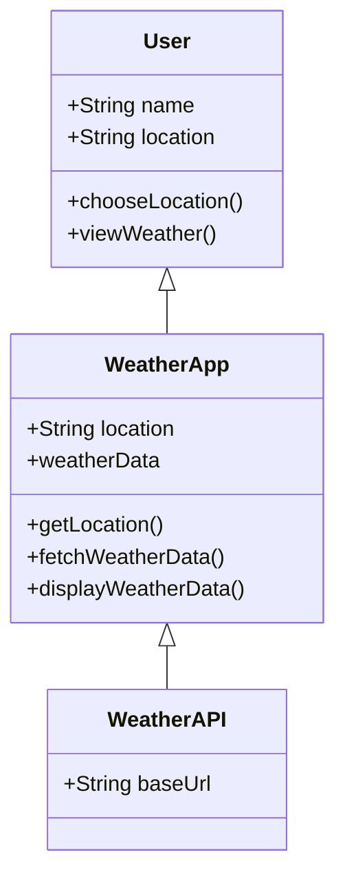
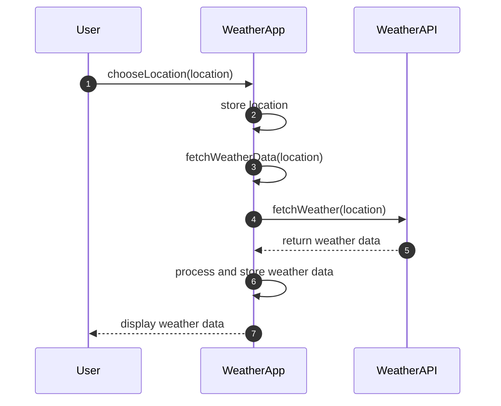
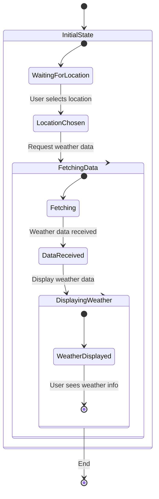
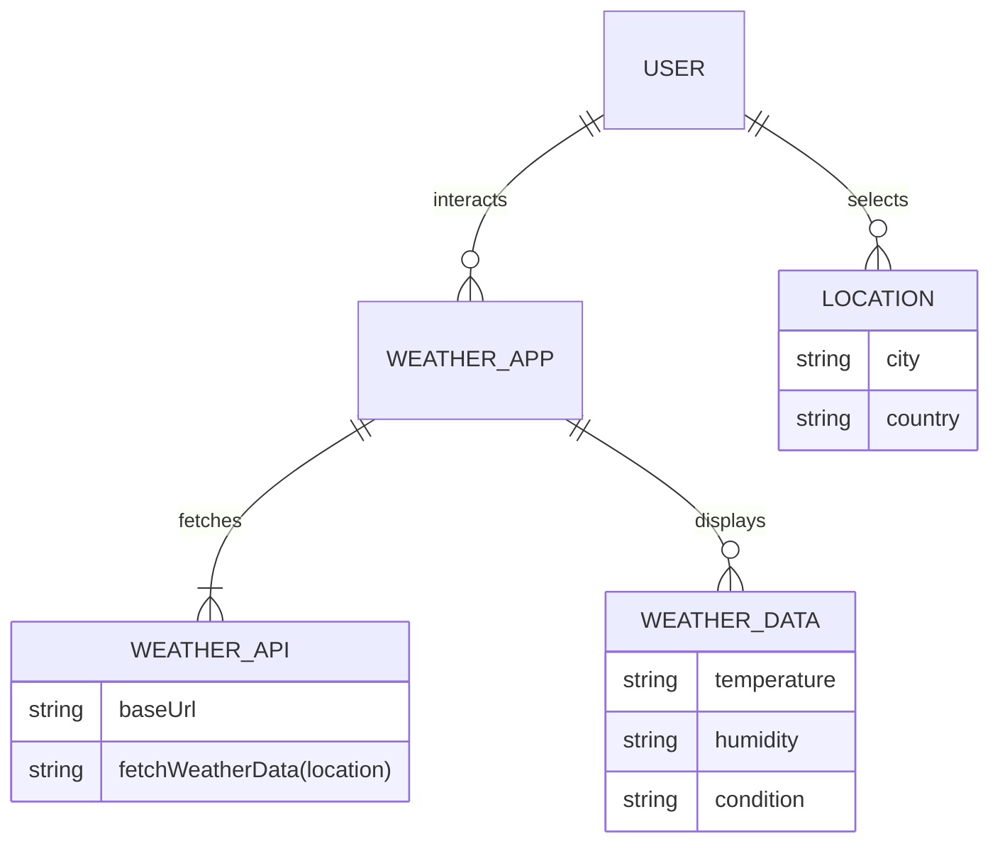

---
hide:
  - navigation
  - toc
  - footer
---

# Class Diagram

```mermaid
classDiagram
  User <|-- WeatherApp
  WeatherApp <|-- WeatherAPI

  User : +String name
  User : +String location
  User : +chooseLocation()
  User : +viewWeather()

  WeatherApp : +String location
  WeatherApp : +weatherData
  WeatherApp : +getLocation()
  WeatherApp : +fetchWeatherData()
  WeatherApp : +displayWeatherData()

  WeatherAPI : +String baseUrl
```
# Sequence Diagram

``` mermaid
sequenceDiagram
  autonumber
  User->>WeatherApp: chooseLocation(location)
  WeatherApp->>WeatherApp: store location
  WeatherApp->>WeatherApp: fetchWeatherData(location)
  WeatherApp->>WeatherAPI: fetchWeather(location)
  WeatherAPI-->>WeatherApp: return weather data 
  WeatherApp->>WeatherApp: process and store weather data
  WeatherApp-->>User: display weather data
 
```
# State Diagram

``` mermaid
stateDiagram-v2
    [*] --> InitialState

    state InitialState {
      [*] --> WaitingForLocation
      WaitingForLocation --> LocationChosen : User selects location
      LocationChosen --> FetchingData : Request weather data
    }

    state FetchingData {
      [*] --> Fetching
      Fetching --> DataReceived : Weather data received
      DataReceived --> DisplayingWeather : Display weather data
    }

    state DisplayingWeather {
      [*] --> WeatherDisplayed
      WeatherDisplayed --> [*] : User sees weather info
    }

  InitialState --> FetchingData
  FetchingData --> DisplayingWeather
  DisplayingWeather --> [*] : End

```
# ER Diagram 

``` mermaid
erDiagram
  USER ||--o{ WEATHER_APP : interacts
  WEATHER_APP ||--|{ WEATHER_API : fetches
  WEATHER_API {
    string baseUrl
    string fetchWeatherData(location)
  }
  USER ||--o{ LOCATION : selects
  LOCATION {
    string city
    string country
  }
   WEATHER_APP ||--o{ WEATHER_DATA : displays
   WEATHER_DATA {
    string temperature
    string humidity
    string condition
  }
```

